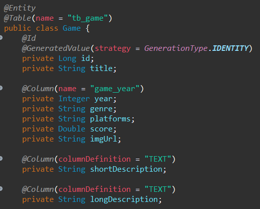
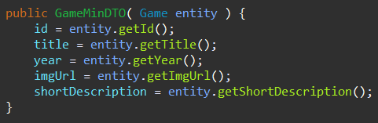
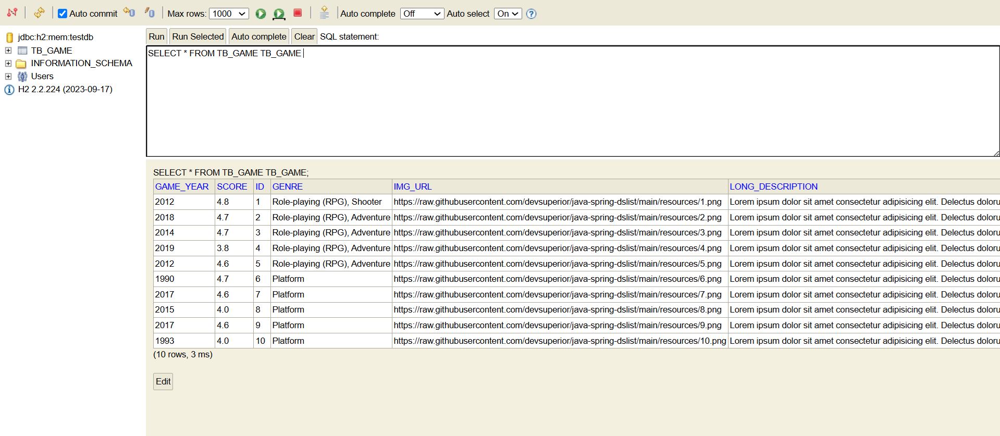
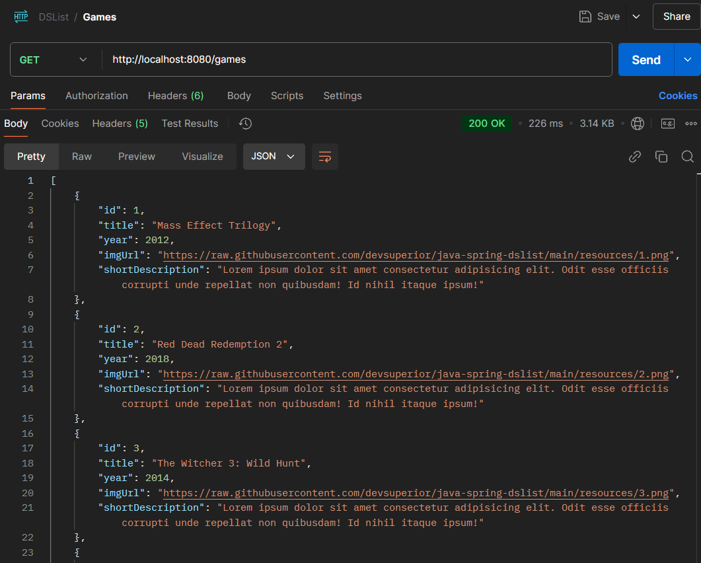

# dslist - Java Spring

## Projeto de manipulação e acesso a um BD de Jogos
<p>
  Um projeto simples de preenchimento, manipulação e acesso de informações em um banco de dados H2. Disso obtém-se uma API, que, a partir do método GET "/games" retorna uma versão reduzida de cada um dos jogos do banco de dados.
</p>

<br>
<hr>
<br>

### Como Funciona?

  A interface GameRepository herda de JpaRepository, que disponibiliza o método `findAll()`, usamos esse método para buscar, no banco de dados, uma Lista do tipo `Game` (que, por sua vez, é uma tabela do BD). Esse retorno é convertido numa lista do tipo `GameMinDTO` (um `Data Tranfer Object` de Game, que reduz o objeto a apenas o que se espera dele no Client, a fim de minimizar o tempo de espera). 
<br>
  Assim, ao acessar a rota `localhost:8080/games` com o método `GET`, obtém-se a lista minimizada das informações de cada jogo armazenado no banco de dados.

<br>
<hr>
<br>

## Visualização:

<br>

### Classe Game / Tabela tb_games:

<br>
A tabela criada acima é preenchida através de um arquivo chamado `import.sql`:
```sql
INSERT INTO tb_game (title, score, game_year, genre, platforms, img_url, short_description, long_description) VALUES ('Mass Effect Trilogy', 4.8, 2012, 'Role-playing (RPG), Shooter', 'XBox, Playstation, PC', 'https://raw.githubusercontent.com/devsuperior/java-spring-dslist/main/resources/1.png', 'Lorem ipsum dolor sit amet consectetur adipisicing elit. Odit esse officiis corrupti unde repellat non quibusdam! Id nihil itaque ipsum!', 'Lorem ipsum dolor sit amet consectetur adipisicing elit. Delectus dolorum illum placeat eligendi, quis maiores veniam. Incidunt dolorum, nisi deleniti dicta odit voluptatem nam provident temporibus reprehenderit blanditiis consectetur tenetur. Dignissimos blanditiis quod corporis iste, aliquid perspiciatis architecto quasi tempore ipsam voluptates ea ad distinctio, sapiente qui, amet quidem culpa.');
INSERT INTO tb_game (title, score, game_year, genre, platforms, img_url, short_description, long_description) VALUES ('Red Dead Redemption 2', 4.7, 2018, 'Role-playing (RPG), Adventure', 'XBox, Playstation, PC', 'https://raw.githubusercontent.com/devsuperior/java-spring-dslist/main/resources/2.png', 'Lorem ipsum dolor sit amet consectetur adipisicing elit. Odit esse officiis corrupti unde repellat non quibusdam! Id nihil itaque ipsum!', 'Lorem ipsum dolor sit amet consectetur adipisicing elit. Delectus dolorum illum placeat eligendi, quis maiores veniam. Incidunt dolorum, nisi deleniti dicta odit voluptatem nam provident temporibus reprehenderit blanditiis consectetur tenetur. Dignissimos blanditiis quod corporis iste, aliquid perspiciatis architecto quasi tempore ipsam voluptates ea ad distinctio, sapiente qui, amet quidem culpa.');
INSERT INTO tb_game (title, score, game_year, genre, platforms, img_url, short_description, long_description) VALUES ('The Witcher 3: Wild Hunt', 4.7, 2014, 'Role-playing (RPG), Adventure', 'XBox, Playstation, PC', 'https://raw.githubusercontent.com/devsuperior/java-spring-dslist/main/resources/3.png', 'Lorem ipsum dolor sit amet consectetur adipisicing elit. Odit esse officiis corrupti unde repellat non quibusdam! Id nihil itaque ipsum!', 'Lorem ipsum dolor sit amet consectetur adipisicing elit. Delectus dolorum illum placeat eligendi, quis maiores veniam. Incidunt dolorum, nisi deleniti dicta odit voluptatem nam provident temporibus reprehenderit blanditiis consectetur tenetur. Dignissimos blanditiis quod corporis iste, aliquid perspiciatis architecto quasi tempore ipsam voluptates ea ad distinctio, sapiente qui, amet quidem culpa.');
INSERT INTO tb_game (title, score, game_year, genre, platforms, img_url, short_description, long_description) VALUES ('Sekiro: Shadows Die Twice', 3.8, 2019, 'Role-playing (RPG), Adventure', 'XBox, Playstation, PC', 'https://raw.githubusercontent.com/devsuperior/java-spring-dslist/main/resources/4.png', 'Lorem ipsum dolor sit amet consectetur adipisicing elit. Odit esse officiis corrupti unde repellat non quibusdam! Id nihil itaque ipsum!', 'Lorem ipsum dolor sit amet consectetur adipisicing elit. Delectus dolorum illum placeat eligendi, quis maiores veniam. Incidunt dolorum, nisi deleniti dicta odit voluptatem nam provident temporibus reprehenderit blanditiis consectetur tenetur. Dignissimos blanditiis quod corporis iste, aliquid perspiciatis architecto quasi tempore ipsam voluptates ea ad distinctio, sapiente qui, amet quidem culpa.');
INSERT INTO tb_game (title, score, game_year, genre, platforms, img_url, short_description, long_description) VALUES ('Ghost of Tsushima', 4.6, 2012, 'Role-playing (RPG), Adventure', 'XBox, Playstation, PC', 'https://raw.githubusercontent.com/devsuperior/java-spring-dslist/main/resources/5.png', 'Lorem ipsum dolor sit amet consectetur adipisicing elit. Odit esse officiis corrupti unde repellat non quibusdam! Id nihil itaque ipsum!', 'Lorem ipsum dolor sit amet consectetur adipisicing elit. Delectus dolorum illum placeat eligendi, quis maiores veniam. Incidunt dolorum, nisi deleniti dicta odit voluptatem nam provident temporibus reprehenderit blanditiis consectetur tenetur. Dignissimos blanditiis quod corporis iste, aliquid perspiciatis architecto quasi tempore ipsam voluptates ea ad distinctio, sapiente qui, amet quidem culpa.');
INSERT INTO tb_game (title, score, game_year, genre, platforms, img_url, short_description, long_description) VALUES ('Super Mario World', 4.7, 1990, 'Platform', 'Super Ness, PC', 'https://raw.githubusercontent.com/devsuperior/java-spring-dslist/main/resources/6.png', 'Lorem ipsum dolor sit amet consectetur adipisicing elit. Odit esse officiis corrupti unde repellat non quibusdam! Id nihil itaque ipsum!', 'Lorem ipsum dolor sit amet consectetur adipisicing elit. Delectus dolorum illum placeat eligendi, quis maiores veniam. Incidunt dolorum, nisi deleniti dicta odit voluptatem nam provident temporibus reprehenderit blanditiis consectetur tenetur. Dignissimos blanditiis quod corporis iste, aliquid perspiciatis architecto quasi tempore ipsam voluptates ea ad distinctio, sapiente qui, amet quidem culpa.');
INSERT INTO tb_game (title, score, game_year, genre, platforms, img_url, short_description, long_description) VALUES ('Hollow Knight', 4.6, 2017, 'Platform', 'XBox, Playstation, PC', 'https://raw.githubusercontent.com/devsuperior/java-spring-dslist/main/resources/7.png', 'Lorem ipsum dolor sit amet consectetur adipisicing elit. Odit esse officiis corrupti unde repellat non quibusdam! Id nihil itaque ipsum!', 'Lorem ipsum dolor sit amet consectetur adipisicing elit. Delectus dolorum illum placeat eligendi, quis maiores veniam. Incidunt dolorum, nisi deleniti dicta odit voluptatem nam provident temporibus reprehenderit blanditiis consectetur tenetur. Dignissimos blanditiis quod corporis iste, aliquid perspiciatis architecto quasi tempore ipsam voluptates ea ad distinctio, sapiente qui, amet quidem culpa.');
INSERT INTO tb_game (title, score, game_year, genre, platforms, img_url, short_description, long_description) VALUES ('Ori and the Blind Forest', 4, 2015, 'Platform', 'XBox, Playstation, PC', 'https://raw.githubusercontent.com/devsuperior/java-spring-dslist/main/resources/8.png', 'Lorem ipsum dolor sit amet consectetur adipisicing elit. Odit esse officiis corrupti unde repellat non quibusdam! Id nihil itaque ipsum!', 'Lorem ipsum dolor sit amet consectetur adipisicing elit. Delectus dolorum illum placeat eligendi, quis maiores veniam. Incidunt dolorum, nisi deleniti dicta odit voluptatem nam provident temporibus reprehenderit blanditiis consectetur tenetur. Dignissimos blanditiis quod corporis iste, aliquid perspiciatis architecto quasi tempore ipsam voluptates ea ad distinctio, sapiente qui, amet quidem culpa.');
INSERT INTO tb_game (title, score, game_year, genre, platforms, img_url, short_description, long_description) VALUES ('Cuphead', 4.6, 2017, 'Platform', 'XBox, Playstation, PC', 'https://raw.githubusercontent.com/devsuperior/java-spring-dslist/main/resources/9.png', 'Lorem ipsum dolor sit amet consectetur adipisicing elit. Odit esse officiis corrupti unde repellat non quibusdam! Id nihil itaque ipsum!', 'Lorem ipsum dolor sit amet consectetur adipisicing elit. Delectus dolorum illum placeat eligendi, quis maiores veniam. Incidunt dolorum, nisi deleniti dicta odit voluptatem nam provident temporibus reprehenderit blanditiis consectetur tenetur. Dignissimos blanditiis quod corporis iste, aliquid perspiciatis architecto quasi tempore ipsam voluptates ea ad distinctio, sapiente qui, amet quidem culpa.');
INSERT INTO tb_game (title, score, game_year, genre, platforms, img_url, short_description, long_description) VALUES ('Sonic CD', 4, 1993, 'Platform', 'Sega CD, PC', 'https://raw.githubusercontent.com/devsuperior/java-spring-dslist/main/resources/10.png', 'Lorem ipsum dolor sit amet consectetur adipisicing elit. Odit esse officiis corrupti unde repellat non quibusdam! Id nihil itaque ipsum!', 'Lorem ipsum dolor sit amet consectetur adipisicing elit. Delectus dolorum illum placeat eligendi, quis maiores veniam. Incidunt dolorum, nisi deleniti dicta odit voluptatem nam provident temporibus reprehenderit blanditiis consectetur tenetur. Dignissimos blanditiis quod corporis iste, aliquid perspiciatis architecto quasi tempore ipsam voluptates ea ad distinctio, sapiente qui, amet quidem culpa.');
```

<br>
<br>

### Classe GameMinDTO (Versão mais curta e simplificada da classe Game)

<br>
A função dessa classe é, a partir de um objeto Game, gerar uma versão simplificada, que será retornada pela API.

<br>
<br>

### Tabela tb_games no banco de dados gerado:

<br>
Essa tabela é moldada em função dos campos da classe `Game`.

<br>
<br>

### Resultado de um GET request na rota `games`:

<br>
O retorno da api é uma lista de JSONs de objetos do tipo `GameMinDTO`, que foram coletados do BD e tratados a partir dos Games retornados.

<br>
<br>
<br>

<hr>
<br>

## Conteúdo aprendido:
- Conceitos:
  - Sistemas web e recursos
  - Cliente/Servidor, HTTP, JSON
  - Padrão Rest para API web
- Estruturação de projeto Spring Rest
- Entidades e ORM
- Database seeding
- Padrão camadas
- Controller, service, repository
- Padrão DTO
